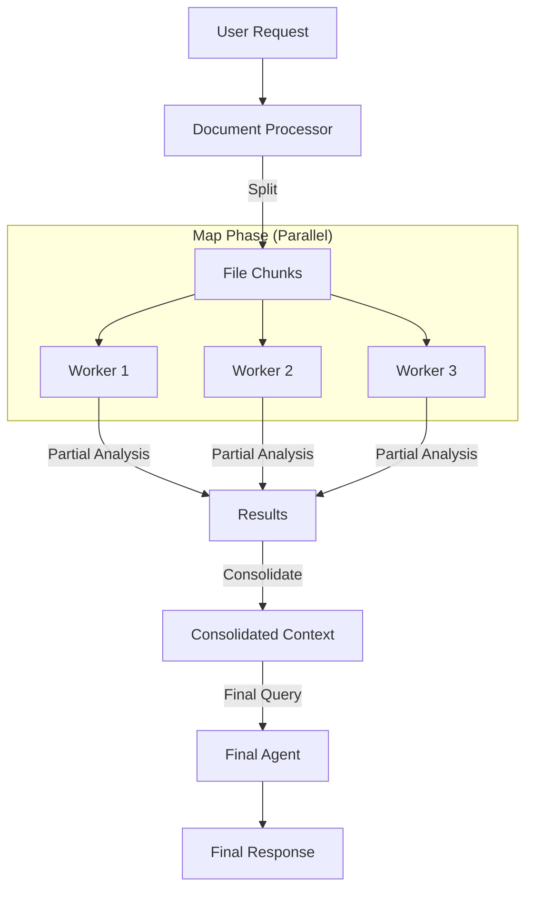

# Using Map-Reduce to process large documents with AI Agents and Python

We live in the era of Large Language Models (LLMs) with massive context windows. Claude 3.5 Sonnet offers 200k tokens, and Gemini 1.5 Pro goes up to 2 million. So, why do we still need to worry about document processing strategies? The answer is yes, we do. For example, AWS Bedrock has a strict limit of 4.5MB for documents, regardless of token count. That's means we can't just stuff file greater than 4.5MB into a prompt. Today we'll show you how I built a production-ready document processing agent that handles large files by implementing a **Map-Reduce** pattern using Python, **AWS Bedrock**, and **Strands Agents**.

The core idea is simple: instead of asking the LLM to "read this book and answer," we break the book into chapters, analyze each chapter in parallel, and then synthesize the results.

Here is the high-level flow:



The heart of the implementation is the `DocumentProcessor` class. It decides whether to process a file as a whole or split it based on a size threshold. We define a threshold (e.g., 4.3MB) to stay safely within Bedrock's limits. If the file is larger, we trigger the `_process_big` method.

```python
# src/lib/processor/processor.py

BYTES_THRESHOLD = 4_300_000

async def _process_file(self, file: DocumentFile, question: str, with_callback=True):
    file_bytes = Path(file.path).read_bytes()
    # Strategy pattern: Choose the right processor based on file size
    processor = self._process_big if len(file_bytes) > BYTES_THRESHOLD else self._process
    async for chunk in processor(file_bytes, file, question, with_callback):
        yield chunk
```

To increase the performance, we use asyncio to process the file in parallel and we use a semaphore to control the number of workers.

```python
async def _process_big(self, file_bytes: bytes, file: DocumentFile, question: str, with_callback=True) -> AsyncIterator[str]:
    # ... splitting logic ...
    semaphore = asyncio.Semaphore(self.max_workers)

    # Create async tasks for each chunk
    tasks = [
        self._process_chunk(chunk, i, file_name, question, handler.format, semaphore)
        for i, chunk in enumerate(chunks, 1)
    ]

    # Run in parallel
    results = await asyncio.gather(*tasks)
    
    # Sort results to maintain document order
    results.sort(key=lambda x: x[0])
    responses_from_chunks = [response for _, response in results]
```

Each chunk is processed by an isolated agent instance that only sees that specific fragment and the user's question. Once we have the partial analyses, we consolidate them. This acts as a compression step: we've turned raw pages into relevant insights.

```python
def _consolidate_and_truncate(self, responses: list[str], num_chunks: int) -> str:
    consolidated = "\n\n".join(responses)
    
    if len(consolidated) > MAX_CONTEXT_CHARS:
        # Safety mechanism to ensure we don't overflow the final context
        return consolidated[:MAX_CONTEXT_CHARS] + "\n... [TRUNCATED]"
    return consolidated
```

Finally, we feed this consolidated context to the agent for the final answer. In a long-running async process, feedback is critical. I implemented an Observer pattern to decouple the processing logic from the UI/Logging.

```python
# src/main.py

class DocumentProcessorEventListener(ProcessingEventListener):
    async def on_chunk_start(self, chunk_number: int, file_name: str):
        logger.info(f"[Worker {chunk_number}] Processing chunk for file {file_name}")

    async def on_chunk_end(self, chunk_number: int, file_name: str, response: str):
        logger.info(f"[Worker {chunk_number}] Completed chunk for file {file_name}")
```

By breaking down large tasks, we not only bypass technical limits but often get better results. The model focuses on smaller sections, reducing hallucinations, and the final answer is grounded in a pre-processed summary of facts.


We don't just send text; we send the raw document bytes. This allows the model (Claude 4.5 Sonnet via Bedrock) to use its native document processing capabilities. Here is how we construct the message payload:

```python
# src/lib/processor/processor.py

def _create_document_message(self, file_format: str, file_name: str, file_bytes: bytes, text: str) -> list:
    return [
        {
            "role": "user",
            "content": [
                {
                    "document": {
                        "format": file_format,
                        "name": file_name,
                        "source": {"bytes": file_bytes},
                    },
                },
                {"text": text},
            ],
        },
    ]
```

When processing chunks, we don't want the model to be chatty. We need raw information extraction. We use a "Spartan" system prompt that enforces brevity and objectivity, ensuring the consolidation phase receives high-signal input.

```python
# src/lib/processor/prompts.py

SYSTEM_CHUNK_PROMPT = f"""
You are an artificial intelligence assistant specialized in reading and analyzing files.
You have received a chunk of a large file.
...
If the user's question cannot be answered with the information in the current chunk, do not answer it directly.

{SYSTEM_PROMPT_SPARTAN}
"""
```

The `SYSTEM_PROMPT_SPARTAN` (injected above) explicitly forbids conversational filler, ensuring we maximize the token budget for actual data.

The project handles pdf and xlsx files. The rest of the file types are not processed and are given to the LLM as-is.

With this architecture, we can process large files in a production environment. This allows us to easily plug in different interfaces, whether it's a CLI logger (as shown) or a WebSocket update for a UI frontend like Chainlit.